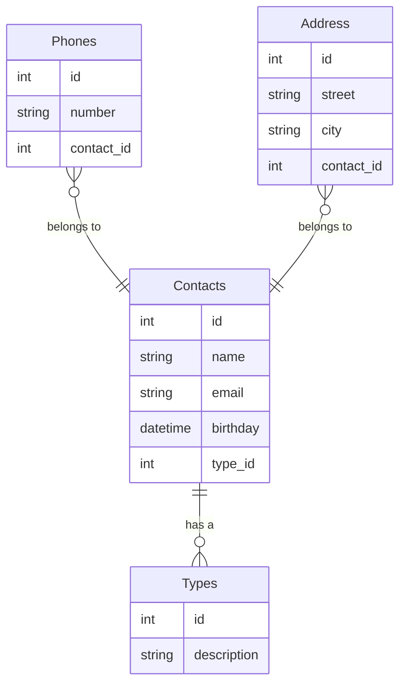

# Notebook API
**Notebook API** é uma aplicação desenvolvida para gerenciar contatos, incluindo informações sobre telefones e endereço. Ela permite a criação, leitura, atualização e exclusão (CRUD) de contatos, que podem ter múltiplos números de telefone e um endereço associado.

## Tecnologias

  
  
  
  

## Diagrama ER

## Licença
Este projeto está licenciado sob a [MIT License](LICENSE).