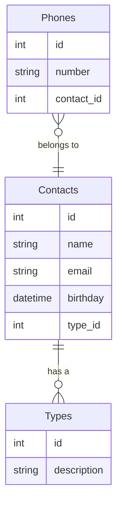

# Notebook API

## Diagrama ER

```mermaid
erDiagram
    Phones {
        int id
        string number
        int contact_id
    }
    Contacts {
        int id
        string name
        string email
        datetime birthday
        int type_id
    }
    Types {
        int id
        string description
    }

    Phones }o--|| Contacts: "belongs to"
    Contacts ||--o{ Types: "has a"
```